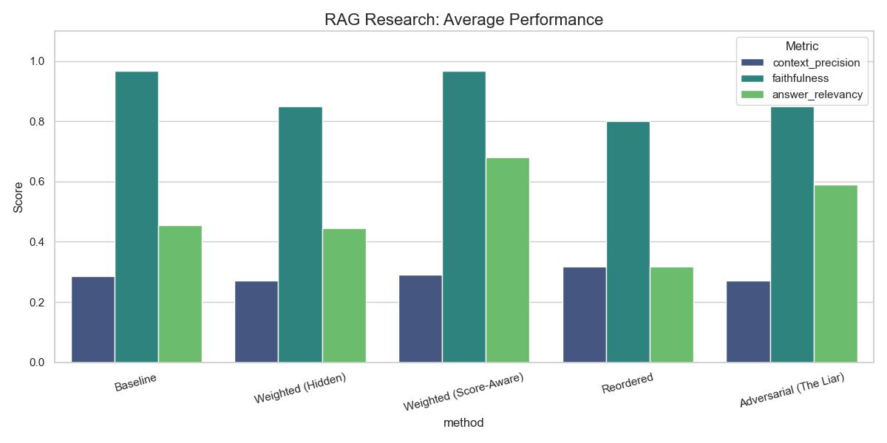

# Local RAG Benchmark: Score-Awareness & Adversarial Resilience


Benchmarking the resilience of Score-Aware RAG systems against metadata attacks using fully local LLMs.

## Research Goal
Standard RAG systems treat all retrieved documents as equally "true." This project investigates:
1.  **Score-Awareness:** Does explicitly showing the LLM a "Confidence Score" (e.g., `[Confidence: 0.99]`) improve generation quality?
2.  **Adversarial Resilience:** If we "lie" to the model (labeling noise as high confidence), does the model fail or filter the noise?

## Key Results
We benchmarked 5 architectures on the **SQuAD v1.1** dataset using **Mistral-7B**.

| Architecture | Answer Relevancy | Result |
| :--- | :--- | :--- |
| **Baseline (Top-K)** | 0.44 | Poor context selection |
| **Weighted (Hidden)** | 0.44 | Re-ranking alone didn't help Mistral |
| **Reordered** | 0.32 | "Lost in the Middle" optimization *hurt* performance |
| **Score-Aware** | **0.68** | **+54% Improvement** over baseline |
| **Adversarial (The Liar)** | 0.59 | **Partial Resilience** (-13% drop) |

### Performance Comparison


> **Conclusion:** Injecting confidence scores into the prompt is the most effective optimization for local RAG, far outperforming context re-ordering. The model showed surprising resilience to adversarial metadata attacks.

## Installation

### 1. Prerequisites
* **Python 3.10+**
* **Ollama** installed and running on your local machine.

### 2. Setup Environment
Clone the repository and install the dependencies.

```bash
git clone [https://github.com/ovedtal1/Score_Aware_RAG.git](https://github.com/ovedtal1/Score_Aware_RAG.git)
cd local-rag-benchmark
pip install -r requirements.txt